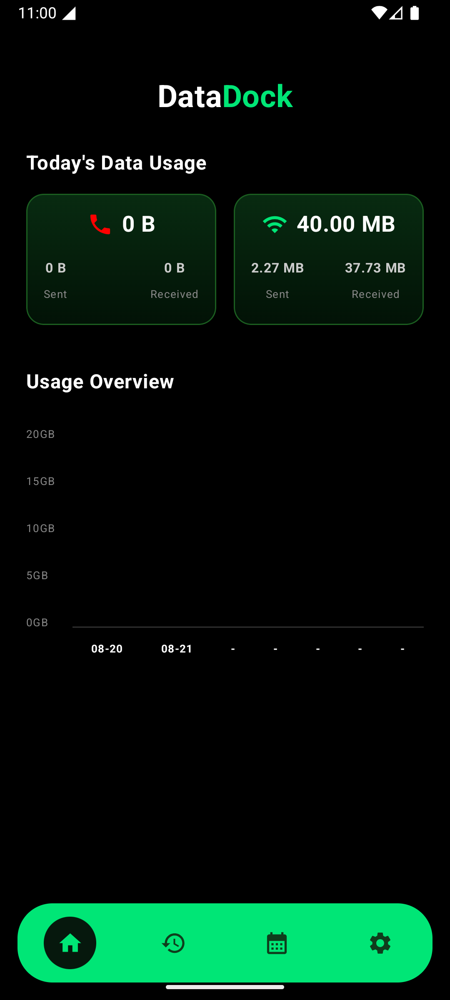
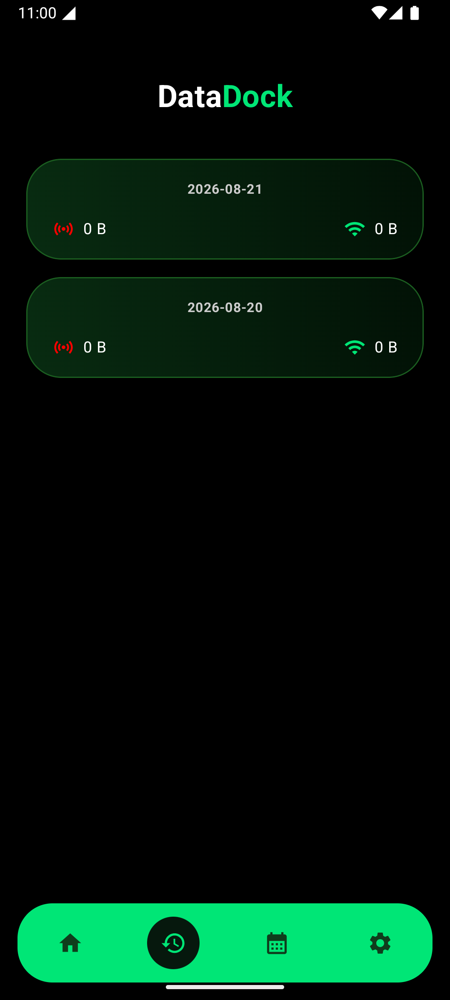
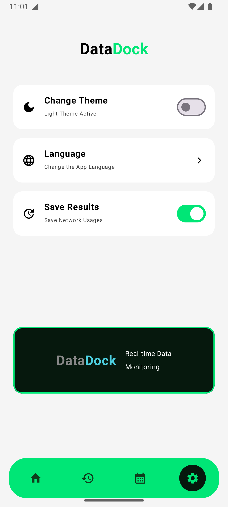
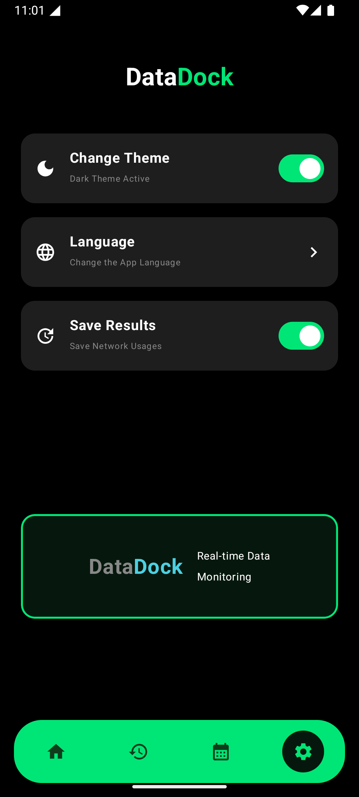
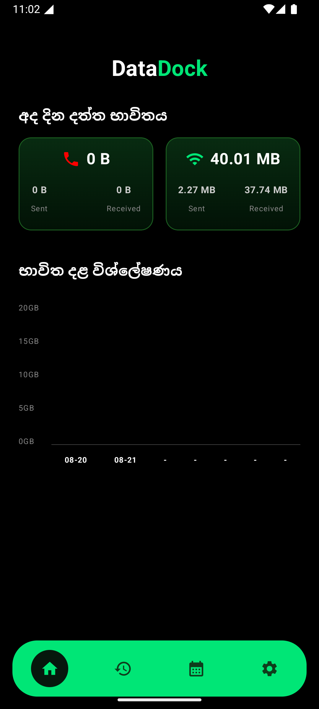
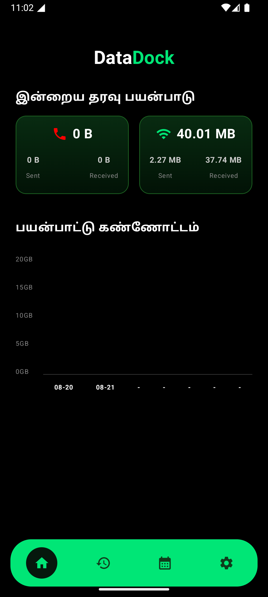
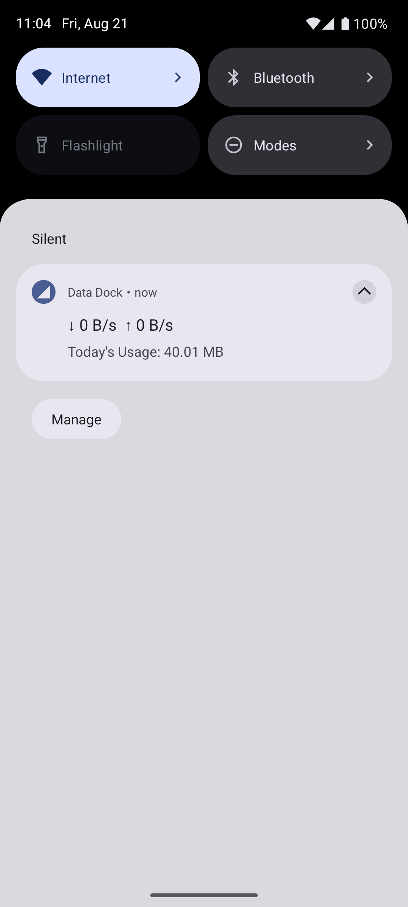

# Data Dock

A privacy-first, offline Android network telemetry tool that tracks live bandwidth usage and daily data limits using a modern Jetpack Compose UI.

## 📱 App Showcase

<!-- Replace the 'src' paths with the actual names of your screenshot files -->
<div align="center">
  <h3>General UI & Dashboard</h3>
  
  

<h3>Theme Switching (Light & Dark Mode)</h3>



<h3>Native Localization (Sinhala & Tamil)</h3>



<h3>Live Telemetry Notification</h3>

</div>

---

## Core Features

* **Live Telemetry:** Monitors real-time Wi-Fi and Mobile data speeds via a persistent, lightweight Foreground Service.
* **Historical Tracking:** Logs daily bandwidth consumption and visualizes past usage through dynamic Compose canvas charts.
* **Custom Billing Cycles:** Allows users to set specific monthly reset dates to accurately track data plan limits.
* **Dynamic Theming:** Seamlessly adapts to system-level Light and Dark modes using Material 3 color schemes.
* **Native Localization:** Full translation support for English, Sinhala, and Tamil out of the box.

## Tech Stack & Architecture

* **UI Framework:** 100% Jetpack Compose for a declarative, highly reactive interface.
* **Local Persistence:** Room (SQLite) database for secure, sandboxed on-device data storage.
* **Background Processing:** Android WorkManager for battery-efficient daily logging while the device sleeps.
* **System APIs:** Deep integration with `NetworkStatsManager` and `TrafficStats` for granular network monitoring.
* **State Management:** Reactive architecture utilizing Kotlin Flows and `collectAsState()` for instantaneous UI updates.

## Privacy & Security

Data Dock operates on a strict zero-trust model. All telemetry data is sandboxed exclusively within the device's internal storage. There are no remote REST APIs, third-party analytics, or cloud integrations. This guarantees that personal bandwidth data cannot be leaked, accessed, or monitored externally.

## How to Build and Run

1. Clone this repository:
   ```bash
   git clone [https://github.com/yourusername/datadock.git](https://github.com/yourusername/datadock.git)
   
2. Open the project in Android Studio.

3. Allow Gradle to sync and download all required dependencies.

4. Connect a physical Android device or start an Emulator.

5. Click Run (Shift + F10).

### Note: You must grant the "Usage Access" permission when prompted in the app to enable bandwidth tracking.